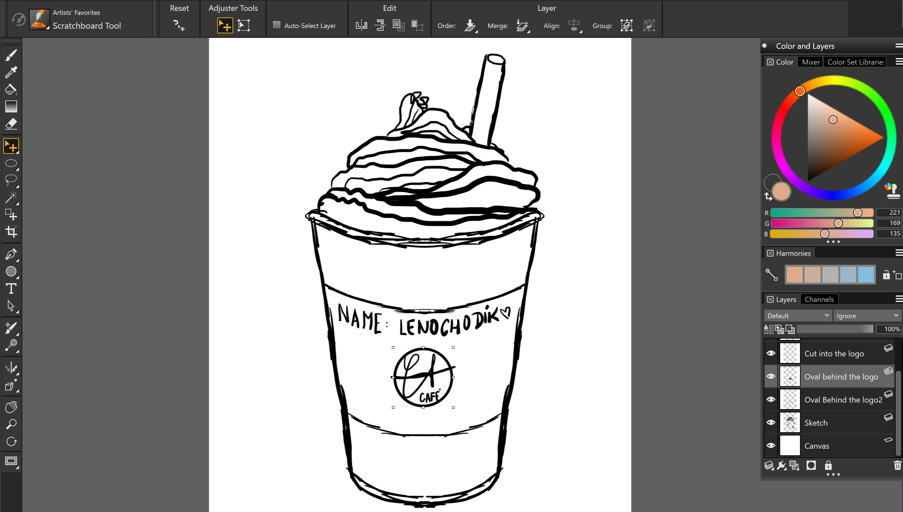
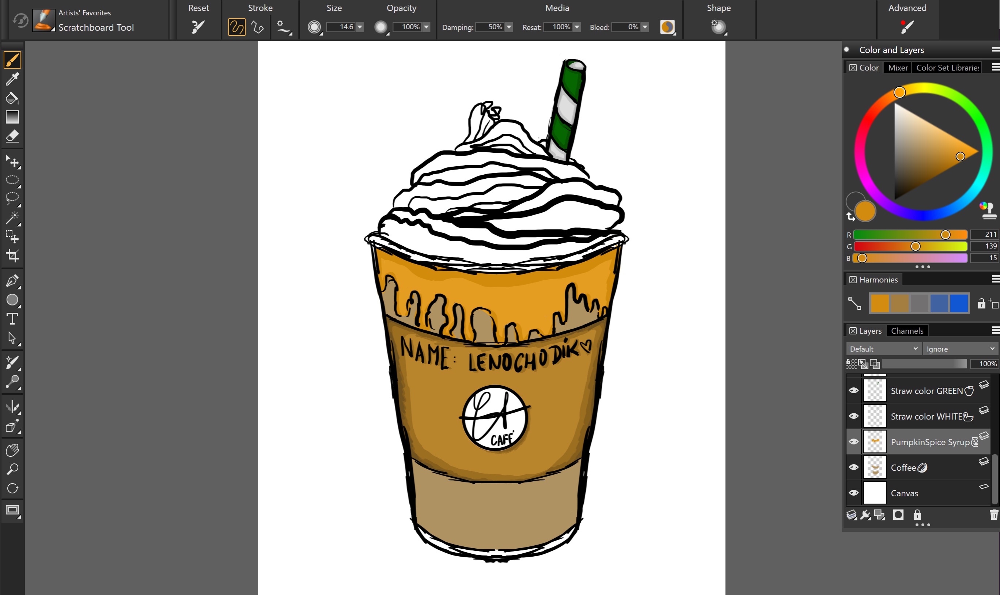
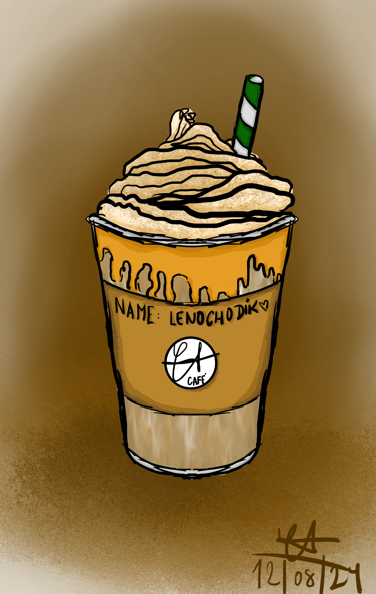

# Digital Painting Projects

## Pumpkin Spice Latte

I have drawn this piece in software Corel Painter with using graphic tablet Wacom.

It is a cup of Pumpkin Spice Latte, because autumn is coming!

I used various tools to make blending in the cup and noise in the bottom background to look more interesting.

### Progress

#### First session

#### Second session

#### Third session - final product

